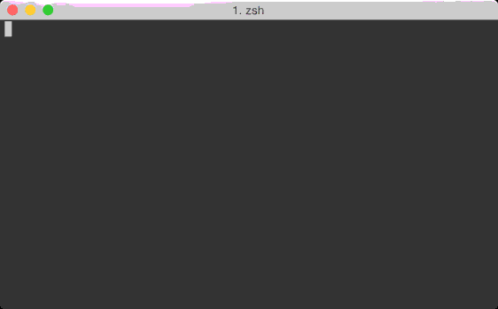

# ctrlp-gonosen.vim [](https://circleci.com/gh/liquidz/ctrlp-gonosen.vim)

A [ctrlp.vim](https://github.com/ctrlpvim/ctrlp.vim) extension to open files across projects.



## Requirements

 * [ctrlp.vim](https://github.com/ctrlpvim/ctrlp.vim)

## Installation

 * [NeoBundle](https://github.com/Shougo/neobundle.vim)
```
NeoBundle 'ctrlpvim/ctrlp.vim' 
NeoBundle 'liquidz/ctrlp-gonosen.vim'
```

## Usage

Execute `:CtrlPGonosen`.

### Project Candidates

 * [`ghq`](https://github.com/motemen/ghq) managed repositories
 * Bookmarked directories
  * Default bookmark file is `~/.bookmark`.
  * Customize your bookmark path with following.
```
let g:gonosen#bookmark_file = '/path/to/your/bookmark.txt'
```

## License

Copyright (c) 2015 [uochan](http://twitter.com/uochan)

Distributed under the MIT License.
